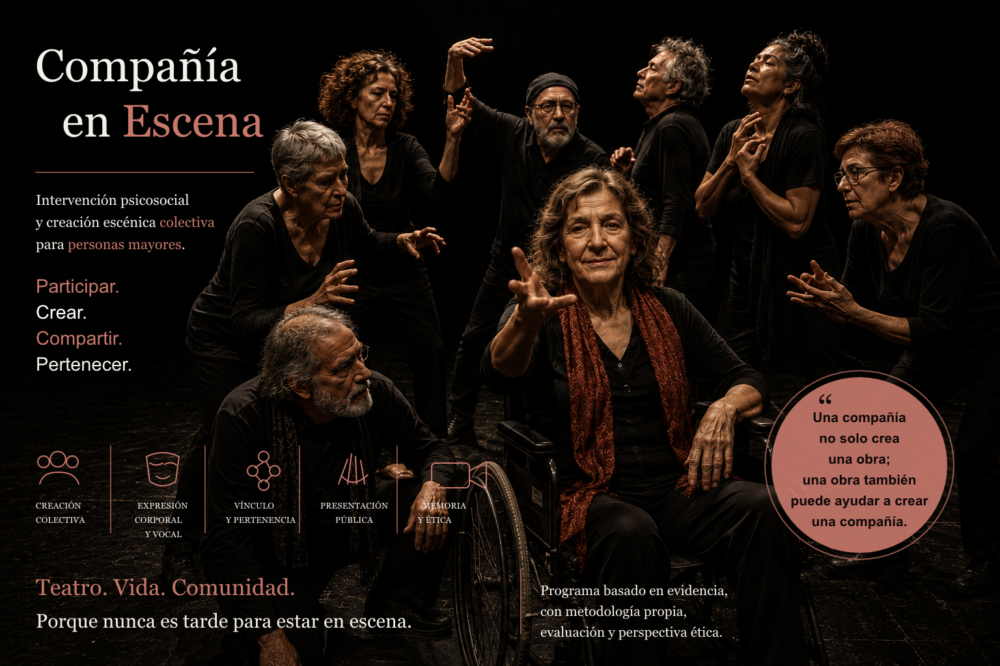

## Programa de Intervención Psicosocial para promover un Envejecimiento Activo y Saludable

Cursos de creación escénica colectiva destinados a _"dar voz a los menos escuchados para que sus historias transformen miradas"_.

Bajo la influencia de Grotowsky y Brook trabajamos por el desarrollo de una _épica de lo cotidiano_, intentando sensibilizar a la sociedad mediante las historias, gestos y capacidades individuales de nuestros participantes.

Compañía en Escena nace de una convicción muy sencilla:
las personas nunca dejan de necesitar comunidad, juego, presencia y creación compartida.

El proyecto surge del encuentro entre las artes escénicas, la intervención psicosocial y una pregunta profundamente humana:
¿qué ocurre cuando varias personas vuelven a reunirse para crear algo juntas?

A través del cuerpo, la voz, la improvisación, la memoria, el humor y el trabajo colectivo, Compañía en Escena transforma un grupo de participantes en una pequeña comunidad temporal capaz de construir:

- escenas,
- recuerdos,
- vínculos,
- rituales,
- experiencias compartidas de significado.

El programa está dirigido principalmente a personas mayores y propone un espacio donde la edad deja de ser entendida únicamente desde el deterioro o la dependencia para reaparecer también como territorio de:

- creatividad,
- sensibilidad,
- juego,
- experiencia,
- presencia cultural.

Cada sesión combina:

- entrenamiento corporal,
- dinámicas escénicas,
- improvisación,
- creación colectiva,
- conversación,
- escucha grupal.

Poco a poco, el grupo desarrolla una representación final nacida de sus propias historias, imaginarios, recuerdos y relaciones.

Sin embargo, el verdadero centro del proyecto no es únicamente la actuación.
Es el proceso humano que aparece entre ensayo y ensayo:
las conversaciones,
las risas,
las inseguridades compartidas,
los pequeños gestos de cuidado,
la confianza que lentamente comienza a existir entre personas que antes eran desconocidas.

Compañía en Escena entiende las artes escénicas no solo como representación, sino como acontecimiento vivo:
un espacio donde los cuerpos vuelven a ocupar lugar,
donde las personas vuelven a ser vistas,
donde la comunidad reaparece temporalmente alrededor de una experiencia compartida.

La representación final y el vídeo conmemorativo funcionan como celebración colectiva y memoria comunitaria.
Durante ese momento confluyen:

- participantes,
- familias,
- amistades,
- profesionales,
- instituciones,
- vecinos,
- comunidad local.

La escena se convierte entonces en algo más que teatro:
se transforma en encuentro humano.

Inspirado parcialmente en referentes como:

- el espacio vacío de Peter Brook,
- el teatro pobre de Jerzy Grotowski,
- la creación colectiva,
- las prácticas performativas contemporáneas,

el programa apuesta por una escena sencilla, accesible y profundamente humana, donde lo importante no es la espectacularidad técnica sino la autenticidad del vínculo y la experiencia compartida.

Compañía en Escena no busca únicamente producir representaciones.
Busca crear lugares donde todavía sea posible:

- jugar,
- imaginar,
- emocionarse,
- construir memoria colectiva,
- sentirse parte de algo compartido.

Porque quizá una comunidad comienza precisamente ahí:
cuando varias personas vuelven a reunirse para crear juntas.
