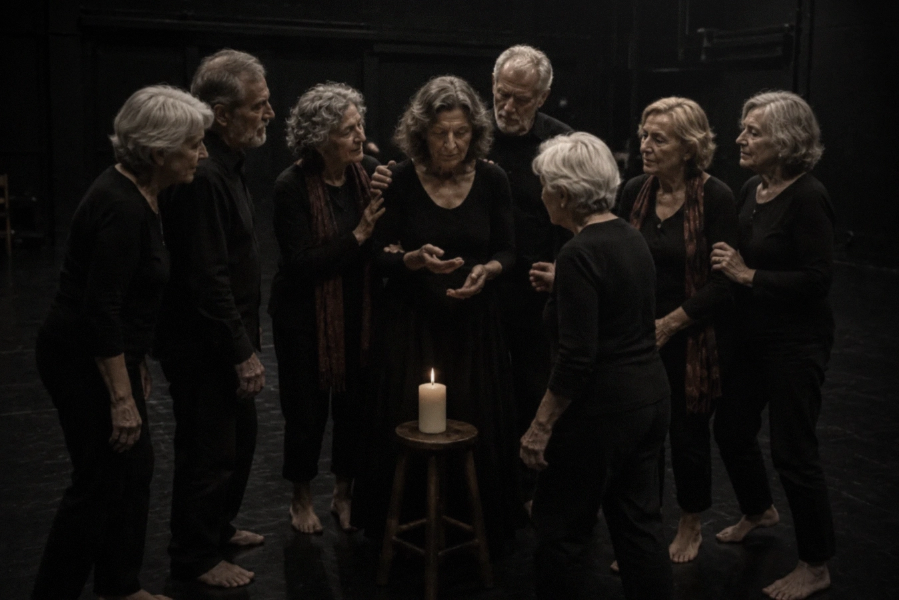
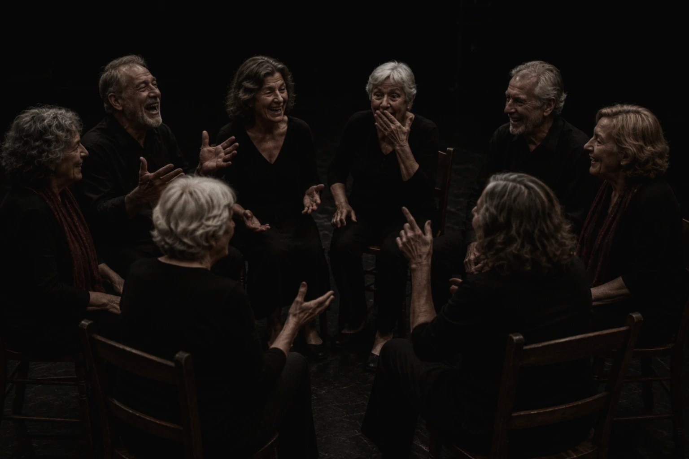
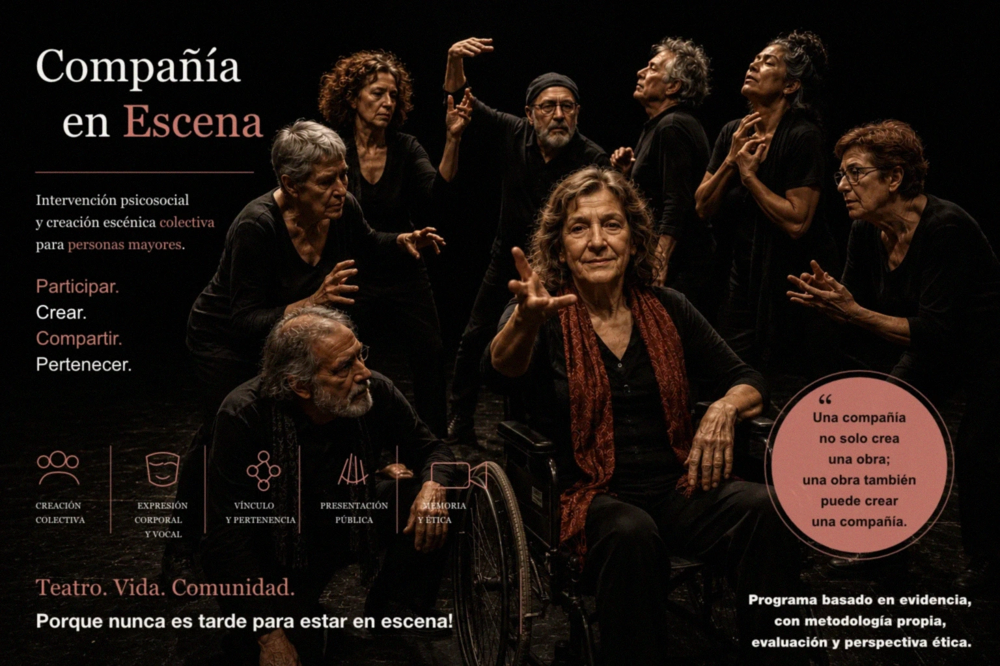

## Intervención psicosocial, envejecimiento saludable y creación escénica colectiva

**Compañía en Escena** es un programa de intervención psicosocial y creación escénica colectiva para personas mayores y contextos comunitarios.

Está dirigido principalmente a personas mayores, aunque puede adaptarse a otros contextos comunitarios, sociales o institucionales. Su finalidad es favorecer la participación, el bienestar, la pertenencia grupal, la expresión personal y el reconocimiento comunitario mediante un proceso escénico estructurado.

El programa parte de una idea sencilla:

> una compañía no sólo crea una obra;  
> una obra también puede crear una compañía.

---

## Qué propone

A lo largo del proceso, un grupo de participantes se constituye progresivamente como compañía.

Cada sesión combina trabajo corporal, respiración, voz, escucha, improvisación, memoria, juego escénico y creación colectiva. A partir de esos materiales, la compañía construye una obra propia que puede compartirse públicamente al final del programa.

La presentación pública no se entiende como un examen ni como una exhibición asistencialista.

Se plantea como un acto de reconocimiento: una oportunidad para que participantes, familias, profesionales, instituciones y comunidad puedan encontrarse alrededor de una creación compartida.

---

## Por qué artes escénicas

Las artes escénicas permiten trabajar dimensiones profundamente humanas:

- presencia;
- cuerpo;
- voz;
- escucha;
- relación;
- memoria;
- confianza;
- exposición progresiva;
- participación;
- creación colectiva.

En Compañía en Escena, el teatro no se utiliza como simple entretenimiento ni como terapia clínica encubierta.

Se utiliza como un espacio de participación significativa, donde las personas pueden ocupar un lugar activo, aportar materiales propios, construir vínculos y ser vistas desde una posición más digna, creativa y compleja.

---

## A quién va dirigido

El programa está especialmente pensado para:

- personas mayores;
- centros de día;
- residencias;
- asociaciones;
- programas de envejecimiento activo;
- proyectos comunitarios;
- contextos intergeneracionales;
- entidades vinculadas a discapacidad, inclusión social o participación cultural.

La metodología puede adaptarse a distintos niveles de autonomía, experiencia previa y condición física.

No es necesario haber hecho teatro antes.

Lo importante no es formar actores profesionales, sino crear una compañía capaz de vivir un proceso artístico compartido con seguridad, cuidado y sentido.

---

## Cómo se desarrolla

El formato estándar se plantea como un proceso de varias semanas, con sesiones regulares de trabajo escénico.

Las sesiones incluyen:

- acogida;
- entrenamiento corporal;
- respiración;
- trabajo vocal;
- entrenamiento escénico;
- descanso;
- composición o ensayo;
- transición;
- cierre.

El proceso avanza de forma progresiva: primero se construye seguridad, después confianza grupal, después lenguaje común, después materiales escénicos, después obra, presentación pública y cierre interno.

---

## Qué busca favorecer

Compañía en Escena busca generar condiciones para que aparezcan:

- participación activa;
- pertenencia;
- confianza grupal;
- expresión corporal y vocal;
- autoeficacia;
- escucha;
- reconocimiento;
- memoria compartida;
- sentido comunitario;
- bienestar subjetivo.

El programa no promete transformaciones automáticas ni resultados idénticos para todas las personas.

Su valor está en ofrecer una estructura cuidada para que un grupo pueda crear, relacionarse, exponerse de forma progresiva y construir algo significativo junto a otras personas.

---

## Una metodología con base técnica y ética

Compañía en Escena se apoya en la evidencia sobre artes participativas, teatro aplicado, envejecimiento saludable, soledad, participación social y competencias relacionales.

La metodología incorpora criterios de seguridad física, seguridad psicológica, consentimiento informado, documentación audiovisual responsable y evaluación prudente.

El proceso puede incluir registro audiovisual y una pieza audiovisual final de la obra, siempre desde el respeto a la privacidad, la dignidad y los derechos de imagen de las personas participantes.

No todo lo vivido debe convertirse en archivo.

Algunas experiencias necesitan simplemente ser compartidas.

---

## El centro del proyecto

El verdadero centro de Compañía en Escena no es únicamente la obra final.

Es lo que ocurre durante el proceso:

las primeras dudas,  
los gestos de confianza,  
las voces que empiezan a escucharse,  
los cuerpos que ocupan de nuevo un espacio,  
las risas durante el descanso,  
los objetos que adquieren significado,  
las escenas que aparecen poco a poco,  
la compañía que empieza a reconocerse a sí misma.

Porque una comunidad puede comenzar precisamente ahí:

cuando varias personas vuelven a reunirse para crear algo significativo juntas.
