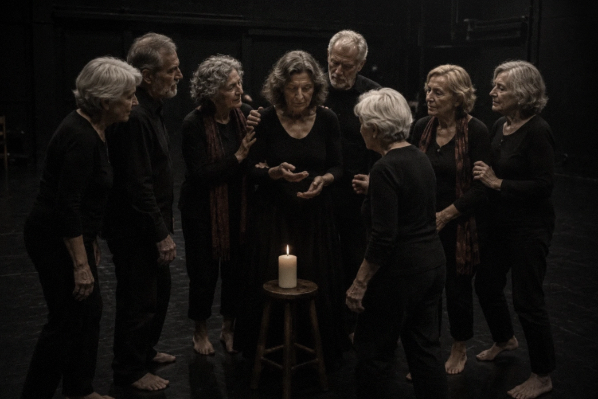
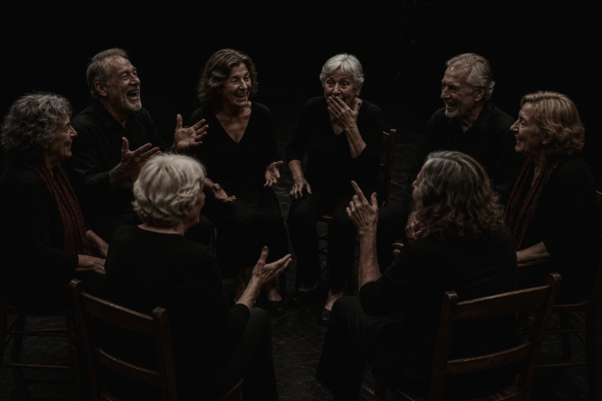
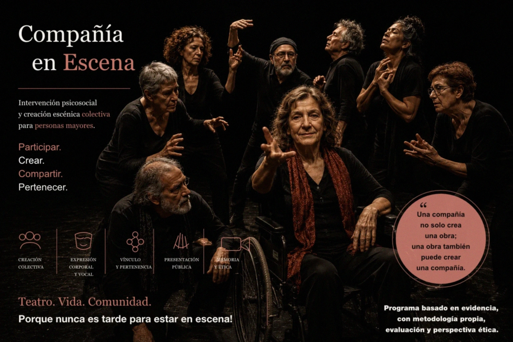

## Metodología de creación escénica colectiva, participación comunitaria y envejecimiento activo y saludable

**Compañía en Escena (CñE)** es una metodología de intervención psicosocial y creación escénica colectiva dirigida principalmente a personas mayores y contextos comunitarios.

Propone que un grupo de participantes se constituya progresivamente como compañía, trabaje cuerpo, respiración, voz, escucha, improvisación y composición escénica, y cree una obra propia que se presenta públicamente ante su comunidad.

CñE no es un taller recreativo, ni una terapia, ni una formación actoral orientada al rendimiento. Es una metodología estructurada para crear condiciones de presencia, vínculo, reconocimiento y participación a través de una experiencia escénica compartida.

> La unidad básica del programa no es el ejercicio ni la sesión.  
> La unidad básica es la compañía.

Proyecto en fase de implementación piloto, con documentación técnica pública y citable, en colaboración con instituciones, centros de mayores, entidades culturales y programas comunitarios.

---

## Qué es Compañía en Escena

Una obra puede ser mucho más que un resultado final. Puede funcionar como estructura común, como horizonte de trabajo y como motivo compartido para que un grupo se reúna, se escuche, ensaye, decida y aparezca ante otros.

Durante el proceso, las personas participantes no solo realizan ejercicios escénicos: se incorporan a una compañía temporal que trabaja con materiales corporales, vocales, imaginarios y colectivos hasta construir una pieza escénica propia.

La presentación pública no se entiende como examen ni como demostración de talento. Se plantea como un acto de reconocimiento: un momento en el que la compañía comparte una creación con su comunidad, sus familias, profesionales e instituciones.

El valor del programa no reside únicamente en la obra final, sino en todo el proceso que permite que esa obra llegue a existir, y en lo que ese proceso construye dentro del grupo.

---

## Por qué nace CñE

El envejecimiento no puede abordarse únicamente desde la salud, la asistencia o la ocupación del tiempo. Muchas personas mayores necesitan también espacios donde seguir apareciendo como sujetos activos, creativos, capaces de decidir, vincularse y formar parte de algo común.

La soledad y la desconexión social, hoy objeto de estrategias públicas específicas, no siempre se resuelven añadiendo actividades. A veces es necesario crear experiencias donde la participación tenga forma, sentido y consecuencia.

CñE nace para responder a esa necesidad desde las artes escénicas, sin convertir el teatro en un fin cerrado sobre sí mismo. Se inscribe en la evidencia creciente sobre el papel de las artes participativas en la salud y el bienestar, sintetizada, entre otros, por la Organización Mundial de la Salud, y la concreta en un formato específico: la compañía.

La metodología no presenta la vejez como carencia. Trabaja desde el cuerpo tal como es: no un instrumento que ejecuta, sino un lugar donde memoria, emoción, imaginación, hábito y presencia se articulan. Un cuerpo cargado de tiempo, no deficitario. Por eso CñE no exige traducir a palabras lo que se piensa, se siente o se hace: lo significativo puede aparecer en un gesto, una pausa, una imagen.

---

## Una metodología de compañía

En CñE, la compañía es el centro metodológico, y la razón es precisa.

Compartir espacio y actividad no basta para vincular a un grupo. Lo que cohesiona a un colectivo humano es un relato común: una historia que el grupo construye y pasa a poseer en común. En CñE, ese relato es la obra. Crearla, aportar materiales, decidir, ensayar y sostenerla ante otros convierte a un conjunto de personas en una compañía, y esa pertenencia, no la mera asistencia, es la que el programa pone al servicio de la conexión social.

Por eso la cohesión no se espera como subproducto de pasar tiempo juntos: es la consecuencia de coautorar y sostener una creación compartida. Y por eso mismo la ética no es aquí un añadido, sino parte del funcionamiento: la compañía se cohesiona en la medida en que el relato que crea es genuinamente común, de todas sus voces y no solo de las más presentes.

La compañía no aparece de golpe. Se construye sesión a sesión, mediante presencia, escucha, repetición, confianza, errores compartidos, decisiones colectivas y pequeñas formas de reconocimiento mutuo.

Una compañía no solo crea una obra. Una obra también puede crear una compañía.

---

## Cómo funciona el proceso

CñE se desarrolla con una secuencia que construye seguridad, lenguaje común, materiales escénicos, obra, presentación pública y cierre:

- **Acogida**: entrada, información y seguridad.
- **Confianza**: vínculo, continuidad y clima de grupo.
- **Cuerpo y voz**: presencia, respiración y ritmo.
- **Improvisación**: juego escénico, escucha y exploración.
- **Materiales**: acciones, imágenes, objetos y recuerdos.
- **Composición**: selección, orden y estructura; la facilitación ordena y da forma sin sustituir la creación del grupo.
- **Ensayo**: repetición, transiciones y derecho al error.
- **Estreno**: la obra, presentada ante la comunidad.
- **Encuentro**: ágape y reconocimiento.
- **Cierre**: evaluación, memoria y despedida.

El formato de referencia: unas 16 semanas, con dos sesiones semanales de 90 minutos y grupos de 5 a 15 personas, el tamaño óptimo ronda las 10, con estreno público y sesión de cierre. Los requerimientos materiales son mínimos: una sala adecuada, asientos y materiales escénicos ligeros.

El proceso no busca resultados rápidos. Trabaja con una progresión lenta y acumulativa, y esa lentitud no se disimula como limitación: se compone con ella. En escena, la lentitud es concentración, escucha y tiempo visible: una cualidad, no una concesión.

---

## Qué lo hace diferente

**La compañía temporal.** La metodología no se organiza alrededor de actividades, sino alrededor de la construcción de un grupo capaz de crear y sostener una obra propia.

**La obra como estructura de sentido.** La creación final no es un adorno: ordena el proceso, orienta el trabajo y ofrece una forma pública a la experiencia vivida.

**La presencia antes que la expresividad.** CñE no necesita que todas las personas sean expresivas; necesita que puedan estar. Mirar, respirar, sostener una pausa tienen ya valor escénico. La pregunta no es qué sabe hacer cada persona, sino cómo aparece su presencia cuando se le da tiempo.

**La presentación pública digna.** La compañía no "muestra una actividad": presenta una obra con nombre propio. Y esa presentación no estetiza la fragilidad ni la exhibe como rareza; la dirección escénica busca una forma en la que cada cuerpo concreto pueda aparecer con potencia y dignidad.

**El ágape.** Tras el estreno, el encuentro con público, familias y comunidad cierra la experiencia desde su dimensión relacional.

**El rigor como carta de presentación.** Seguridad con umbrales operativos definidos y una evaluación que no promete lo que aún no puede demostrar; ambas, recogidas en documentación pública y citable.

---

## A quién se dirige

CñE está diseñado principalmente para personas mayores, en contextos donde la participación social, la presencia corporal y el reconocimiento comunitario tienen valor: residencias, centros de día, centros sociales, programas municipales, asociaciones, entidades culturales, proyectos comunitarios e iniciativas de envejecimiento activo.

No es necesaria experiencia teatral previa. Tampoco competencia verbal: buena parte del trabajo discurre por el gesto, la imagen, el ritmo y la presencia, de modo que pueden incorporarse personas con dificultades de lenguaje o de audición, con deterioro cognitivo leve o moderado, mediante adaptaciones, o que simplemente prefieren no exponerse hablando. Observar se reconoce como una forma válida de participación.

La participación es siempre voluntaria e informada, con una valoración inicial cuya finalidad no es excluir, sino ajustar: identificar qué apoyos y adaptaciones necesita cada persona para participar con seguridad.

---

## Seguridad, ética y cuidado

La seguridad no es un complemento de CñE: es la condición sin la cual la actividad no comienza. Cada sesión integra la prevención física, caídas, sobreesfuerzo y graduación del esfuerzo, un encuadre no terapéutico que avanza por la forma y el símbolo sin extraer intimidad ni forzar la emoción, y un marco ético de consentimiento informado y diferenciado, protección de datos, autoría colectiva y dignidad escénica, sin infantilización y sin convertir la vulnerabilidad en espectáculo.

Ante el riesgo, tres umbrales ordenan la respuesta: adaptar, detener, revisar; y lo que excede el marco de la intervención se contiene y se deriva, en coordinación con la institución. Los criterios completos, con sus consecuencias operativas, están recogidos en la [Guía de Seguridad y Ética Aplicada](https://doi.org/10.5281/zenodo.21113679), pública y citable.

La seguridad y la ética no son aquí un límite a la creación, sino su condición: lo que permite que la experiencia ocurra y que la dignidad de quien participa quede protegida.

---

## Evaluación e implementación piloto

La evaluación jerarquiza resultados y triangula métodos. El resultado primario es la soledad percibida y la conexión social; el bienestar y la autoeficacia se exploran como secundarios. La batería cuantitativa, UCLA Loneliness Scale, WEMWBS y Escala de Autoeficacia General, en sus validaciones españolas, se acompaña de un mapa sociométrico de los vínculos creados en el grupo, observación estructurada y una devolución cualitativa de cierre.

En un diseño piloto sin grupo de control, los resultados se leen como indicios de evolución, no como prueba de causalidad: el piloto establece viabilidad, aceptabilidad, seguridad y señal preliminar. La institución que acoge un piloto recibe un informe de la implementación. El marco completo se desarrolla en el [Manual Técnico](https://doi.org/10.5281/zenodo.21113265).

---

## Documentación técnica

CñE cuenta con documentación técnica depositada en Zenodo para su consulta, citación y revisión por parte de instituciones, equipos profesionales y entidades colaboradoras.

- [Manual Técnico de Compañía en Escena](https://doi.org/10.5281/zenodo.21113265): qué es la metodología y por qué opera; hipótesis, mecanismo, fundamentación y marco de evaluación.
- [Guía de Seguridad y Ética Aplicada](https://doi.org/10.5281/zenodo.21113679): el marco con el que, acción por acción, se decide si una propuesta escénica es admisible y cómo hacerla segura sin perder su sentido.

---

## Mi papel en el proyecto

Compañía en Escena es un proyecto desarrollado por Joaquín Medina en la intersección entre psicología, envejecimiento, artes escénicas y lenguaje audiovisual: la formación en Psicología y Envejecimiento se cruza aquí con años de experiencia en procesos escénicos, trabajo de compañía, creación colectiva y documentación audiovisual, desde la convicción de que las artes escénicas pueden ofrecer algo específico a los contextos psicosociales cuando no se usan como adorno, entretenimiento o terapia encubierta, sino como estructura de presencia, vínculo y reconocimiento.

---

## Colaboración e implementación

CñE está preparado para iniciar implementaciones piloto en colaboración con instituciones, centros de mayores, residencias, centros de día, ayuntamientos, fundaciones, entidades culturales o proyectos comunitarios.

La colaboración puede orientarse a una primera experiencia piloto, una adaptación contextual del programa o el diseño de una implementación evaluable. El programa requiere una sala adecuada, un calendario estable, una persona de referencia, un grupo de participantes informados y una institución dispuesta a sostener un proceso de varias semanas; la conducción metodológica, la seguridad y la evaluación corresponden a la facilitación.

Las instituciones interesadas pueden solicitar el dossier ejecutivo del programa, con el detalle del piloto, sus condiciones y sus requisitos.

CñE no propone una actividad puntual. Propone acompañar la aparición de una compañía. Y cuando una compañía aparece, aunque sea temporalmente, también aparece otra forma de mirar a quienes la forman: no como usuarios de una actividad, sino como personas capaces de crear, sostener una obra y compartirla con su comunidad.

¿Quieres valorar una implementación piloto de Compañía en Escena en tu institución o proyecto comunitario?

**[Contacta para solicitar información y estudiar posibles formas de colaboración.](/contacto/)**
