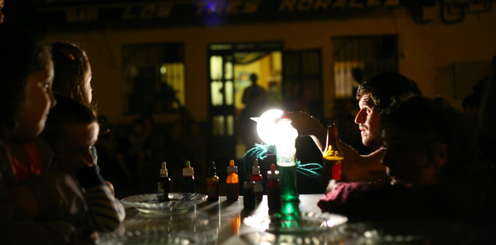
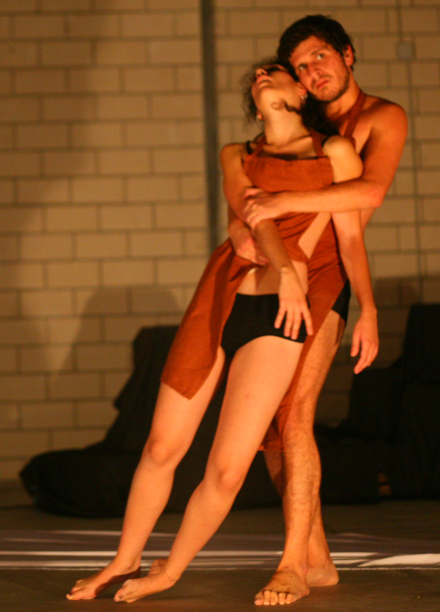
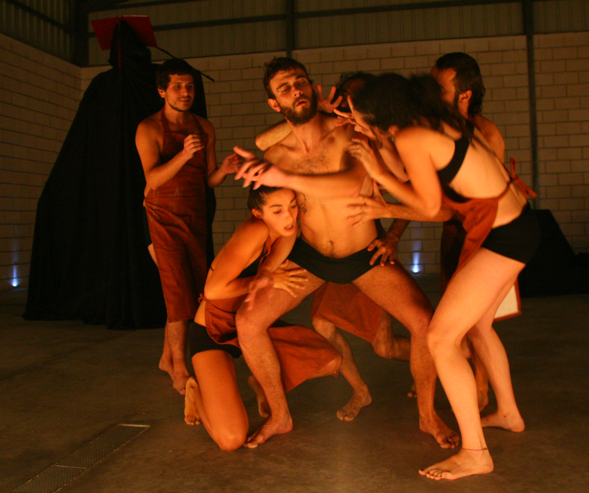

import img3 from '../../assets/images/alcontar3.jpg';
import img4 from '../../assets/images/alcontar4.jpg';
import img5 from '../../assets/images/alcontar5.jpg';
import img6 from '../../assets/images/alcontar8.jpg';
import ImageGallery from '../../components/ImageGallery.astro';
import VideoEmbed from '../../components/VideoEmbed.astro';

## Arte comunitario, participación ciudadana y memoria audiovisual

**Campo de Desconcentración Polivalente** fue un proyecto interdisciplinar de creación artística comunitaria desarrollado en colaboración con el Ayuntamiento de Alcóntar, Almería.

La propuesta transformó el pequeño municipio durante una semana en un espacio de encuentro, experimentación y participación, integrando artistas, vecinos, infancia, jóvenes, instituciones locales y visitantes en un proceso cultural abierto al territorio.

El proyecto combinó artes escénicas, acciones en espacio público, talleres, creación audiovisual y convivencia comunitaria. Su valor principal no residía únicamente en las actividades realizadas, sino en la posibilidad de generar un espacio temporal donde la comunidad pudiera reconocerse desde otros lugares: la escena, la cámara, el juego, el taller, la plaza y la memoria compartida.

<VideoEmbed videoId="28155597" title="Campo de Desconcentración Polivalente - pieza audiovisual" />

---

## Mi participación

Mi participación se desarrolló en varias líneas complementarias.

### Realización audiovisual

Realicé tareas de grabación, edición y documentación audiovisual de algunos recorridos del proyecto, registrando actividades, talleres, acciones escénicas y procesos participativos, materiales que utilicé para realizar el video promocional anterior. Participé como interprete en una representación realizada en el pueblo del espectáculo de Vladimir Tzekov, Misa de Réquiem: La Peste, que formaba parte del proyecto así como en la organización y desarrollo de talleres creativos para infancia, introduciendo elementos básicos del lenguaje audiovisual mediante dinámicas participativas.

El objetivo no era sólo producir imágenes de difusión, sino conservar parte de la experiencia vivida: los encuentros, las acciones, la relación con el espacio público y la implicación de la comunidad local.

### Talleres creativos para infancia

Diseñé y desarrollé talleres de creación audiovisual dirigidos a población infantil, introduciendo elementos básicos del lenguaje audiovisual mediante dinámicas participativas.

El trabajo con niños y niñas permitió acercar la cámara como herramienta de juego, observación, colaboración y expresión.

### Artes escénicas y acción comunitaria

Participé como intérprete junto a la compañía Vladimir Tzekov en la representación de **Misa de Réquiem: La Peste**, una propuesta escénica desarrollada dentro del marco del proyecto.

Esta dimensión escénica reforzó el carácter híbrido de la experiencia: arte contemporáneo, intervención territorial, convivencia comunitaria y experimentación performativa.

---

## Objetivos del proyecto

- Favorecer la participación social y cultural en un entorno rural.
- Generar espacios de convivencia intergeneracional.
- Utilizar las artes como medio de encuentro comunitario.
- Promover la expresión creativa mediante herramientas escénicas y audiovisuales.
- Reforzar el vínculo entre territorio, identidad, memoria y comunidad.
- Documentar procesos artísticos y participativos desde una mirada sensible al contexto.

---

## Metodología de trabajo

El proyecto se desarrolló mediante una metodología participativa, comunitaria y artística, basada en:

- talleres creativos;
- acciones performativas;
- intervención en espacio público;
- creación audiovisual;
- convivencia con la población local;
- colaboración entre artistas, vecinos e instituciones.

La intervención no se planteó como una actividad cultural externa que simplemente llega a un municipio.

Su interés estaba precisamente en la relación entre propuesta artística y contexto: cómo una acción creativa puede modificar temporalmente la forma de mirar un lugar, habitarlo y compartirlo.

---

## Impacto y aprendizaje profesional

Este proyecto fue importante en mi trayectoria porque reunió varias líneas que después han seguido apareciendo en mi trabajo: comunidad, escena, audiovisual, participación, infancia, territorio y memoria de proceso.

Me permitió comprender que la creación artística puede funcionar como una herramienta de encuentro cuando no se impone sobre la comunidad, sino que dialoga con ella.

También reforzó una idea que atraviesa mi trabajo actual:

> no sólo consiste en grabar lo que ocurre; es mejor cuidar cómo será recordado.

---

## Ámbitos de trabajo

- Intervención psicosocial comunitaria.
- Arte comunitario.
- Dinamización cultural rural.
- Artes escénicas.
- Producción audiovisual participativa.
- Talleres creativos para infancia.
- Documentación de procesos artísticos.
- Participación ciudadana.

<ImageGallery
  images={[
    {
      src: img3,
      alt: 'Intervención comunitaria en Alcóntar',
      caption: 'Intervención comunitaria en el marco del proyecto.'
    },
    {
      src: img4,
      alt: 'Taller artístico en Alcóntar',
      caption: 'Talleres y procesos creativos con participación local.'
    },
    {
      src: img5,
      alt: 'Producción audiovisual en Alcóntar',
      caption: 'Registro audiovisual y memoria del proceso.'
    },
    {
      src: img6,
      alt: 'Acción comunitaria en Alcóntar',
      caption: 'Acción artística y encuentro comunitario.'
    }
  ]}
/>

---

## Enlace relacionado

[Web del proyecto](https://campodedesconcentracionpolivalente.blogspot.com/)
